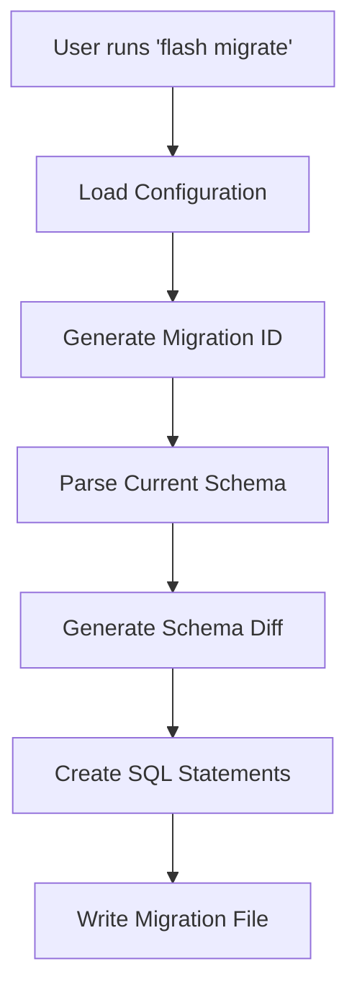
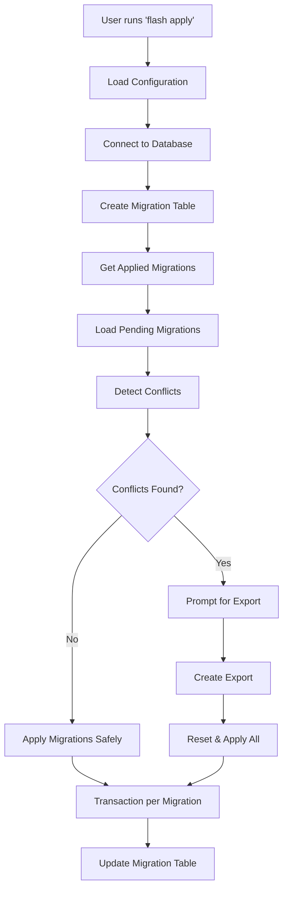

# How FlashORM Works

This document explains the internal architecture and workflow of FlashORM, a database ORM built in Go.

## Table of Contents

- [Architecture Overview](#architecture-overview)
- [Core Components](#core-components)
- [Database Adapters](#database-adapters)
- [Migration Workflow](#migration-workflow)
- [Safe Migration System](#safe-migration-system)
- [Schema Management](#schema-management)
- [Parser System](#parser-system)
- [Code Generation System](#code-generation-system)
- [Export System](#export-system)
- [Configuration System](#configuration-system)
- [Template System](#template-system)
- [NPM Distribution](#npm-distribution)
- [FlashORM Studio Architecture](#FlashORM-studio-architecture)
- [Raw SQL Execution System](#raw-sql-execution-system)
- [Error Handling and Logging](#error-handling-and-logging)
- [Performance Considerations](#performance-considerations)

## Architecture Overview

FlashORM follows a layered architecture with clear separation of concerns:

```
┌─────────────────────────────────────────┐
│              CLI Layer (cmd/)           │
│         Cobra Commands & Flags          │
├─────────────────────────────────────────┤
│           Business Logic Layer          │
│   Migrator, Schema Manager, Export      │
├─────────────────────────────────────────┤
│          Database Adapter Layer         │
│    PostgreSQL, MySQL, SQLite Adapters   │
├─────────────────────────────────────────┤
│            Database Layer               │
│       Actual Database Connections       │
└─────────────────────────────────────────┘
```

## Core Components

### 1. CLI Layer (`cmd/`)

Built using the [Cobra](https://github.com/spf13/cobra) framework, the CLI layer handles:

- **Command Parsing**: Processes user commands and arguments
- **Flag Management**: Handles global and command-specific flags
- **Configuration Loading**: Initializes Viper configuration
- **Error Handling**: Provides user-friendly error messages

**Key Commands:**
- `init`: Project initialization with database-specific templates
- `migrate`: Migration file creation with schema diff
- `apply`: Safe migration execution with transaction rollback
- `status`: Migration status display with detailed information
- `export`: Database export operations (JSON, CSV, SQLite)
- `gen`: Code generation (Go and JavaScript/TypeScript)
- `reset`: Database reset with export option
- `pull`: Schema extraction from existing database
- `raw`: Raw SQL execution
- `studio`: Visual database editor

### 2. Configuration System (`internal/config/`)

Uses [Viper](https://github.com/spf13/viper) for configuration management:

```go
type Config struct {
    SchemaPath     string   `json:"schema_path"`
    QueriesPath    string   `json:"queries"`
    MigrationsPath string   `json:"migrations_path"`
    ExportPath     string   `json:"export_path"`
    Database       Database `json:"database"`
    Gen            Gen      `json:"gen"`
}

type Gen struct {
    JS JSConfig `json:"js"`
}

type JSConfig struct {
    Enabled bool   `json:"enabled"`
    Out     string `json:"out"`
}
```

**Features:**
- JSON-based configuration files
- Environment variable support
- Default value fallbacks
- Configuration validation
- Directory auto-creation

### 3. Database Adapter Pattern (`internal/database/`)

The adapter pattern enables multi-database support through a common interface:

```go
type DatabaseAdapter interface {
    Connect(ctx context.Context, url string) error
    Close() error
    Ping(ctx context.Context) error
    
    // Migration operations
    CreateMigrationsTable(ctx context.Context) error
    GetAppliedMigrations(ctx context.Context) (map[string]*time.Time, error)
    RecordMigration(ctx context.Context, migrationID, name, checksum string) error
    ExecuteMigration(ctx context.Context, migrationSQL string) error
    
    // Schema operations
    GetCurrentSchema(ctx context.Context) ([]types.SchemaTable, error)
    GetTableColumns(ctx context.Context, tableName string) ([]types.SchemaColumn, error)
    
    // Conflict detection
    CheckTableExists(ctx context.Context, tableName string) (bool, error)
    CheckColumnExists(ctx context.Context, tableName, columnName string) (bool, error)
    
    // Export operations
    GetTableData(ctx context.Context, tableName string) ([]map[string]interface{}, error)
    GetAllTableNames(ctx context.Context) ([]string, error)
}
```

### 4. Migration System (`internal/migrator/`)

The migrator orchestrates the entire migration process with safe execution:

**Core Responsibilities:**
- Migration file management
- Conflict detection and resolution
- Schema validation
- Export coordination
- Transaction management with rollback

**Migration File Structure:**
```sql
-- Migration: create_users_table
-- Created: 2025-10-21T13:29:02Z

CREATE TABLE IF NOT EXISTS "users" (
  "id" SERIAL PRIMARY KEY,
  "name" VARCHAR(255) NOT NULL,
  "email" VARCHAR(255) UNIQUE NOT NULL,
  "created_at" TIMESTAMP WITH TIME ZONE NOT NULL DEFAULT NOW()
);
```

### 5. Schema Management (`internal/schema/`)

Handles schema parsing, validation, and diff generation:

**Schema Parsing Process:**
1. **File Reading**: Reads SQL schema files
2. **SQL Cleaning**: Removes comments and normalizes whitespace
3. **Statement Splitting**: Separates individual SQL statements
4. **Table Extraction**: Parses CREATE TABLE statements
5. **Relationship Mapping**: Identifies foreign key relationships

**Schema Diff Generation:**
```go
type SchemaDiff struct {
    NewTables      []SchemaTable
    DroppedTables  []string
    ModifiedTables []TableDiff
    NewIndexes     []SchemaIndex
    DroppedIndexes []string
}
```

### 6. Export System (`internal/export/`)

Multi-format export system with the following features:

**Export Formats:**
- **JSON**: Structured data with metadata
- **CSV**: Individual files per table
- **SQLite**: Portable database file

**Export Structure (JSON):**
```json
{
  "timestamp": "2025-10-21 14:00:07",
  "version": "1.0",
  "comment": "Database export",
  "tables": {
    "users": [
      {"id": 1, "name": "John", "email": "john@example.com"}
    ]
  }
}
```

**Export Triggers:**
- Manual export commands (`flash export`)
- Before destructive operations
- Schema conflict resolution
- Database reset operations

## Database Adapters

### PostgreSQL Adapter (`postgres.go`)

**Technology Stack:**
- **Driver**: [pgx/v5](https://github.com/jackc/pgx) - High-performance PostgreSQL driver
- **Connection Pool**: pgxpool for connection management
- **Query Builder**: [Squirrel](https://github.com/Masterminds/squirrel) for dynamic SQL

**Key Features:**
- Connection pooling optimized for Supabase/PgBouncer
- Advanced PostgreSQL type support
- JSONB and UUID support
- Transaction management with rollback
- Exec mode for pooler compatibility

**Type Mapping:**
```go
var pgTypeMap = map[string]string{
    "character varying": "VARCHAR",
    "timestamp with time zone": "TIMESTAMP WITH TIME ZONE",
    "jsonb": "JSONB",
    "uuid": "UUID",
    // ... more mappings
}
```

### MySQL Adapter (`mysql.go`)

**Technology Stack:**
- **Driver**: [go-sql-driver/mysql](https://github.com/go-sql-driver/mysql)
- **Query Builder**: Squirrel with question mark placeholders
- **Connection**: Standard database/sql interface

**Key Features:**
- MySQL-specific SQL generation
- AUTO_INCREMENT handling
- MySQL type system support
- InnoDB engine optimization

### SQLite Adapter (`sqlite.go`)

**Technology Stack:**
- **Driver**: [mattn/go-sqlite3](https://github.com/mattn/go-sqlite3)
- **File-based**: Single file database
- **Lightweight**: Minimal resource usage

**Key Features:**
- File-based database management
- SQLite-specific constraints
- Embedded database support
- Cross-platform compatibility

## Migration Workflow

### 1. Migration Creation (`flash migrate`)



### 2. Safe Migration Application (`flash apply`)



## Safe Migration System

### Transaction-Based Execution

Each migration runs in its own transaction with automatic rollback on failure:

```go
func (p *PostgresAdapter) ExecuteMigration(ctx context.Context, migrationSQL string) error {
    tx, err := p.pool.Begin(ctx)
    if err != nil {
        return fmt.Errorf("failed to begin transaction: %w", err)
    }
    defer tx.Rollback(ctx) // Auto-rollback on error

    statements := p.parseSQLStatements(migrationSQL)
    
    for _, stmt := range statements {
        if _, err := tx.Exec(ctx, stmt); err != nil {
            return fmt.Errorf("failed to execute statement: %w", err)
        }
    }
    
    return tx.Commit(ctx)
}
```

### Migration Safety Features

**Corruption Prevention:**
- Each migration in separate transaction
- Automatic rollback on any failure
- Migration state tracking
- Broken migration cleanup

**Error Recovery:**
```go
func (m *Migrator) applySingleMigrationSafely(ctx context.Context, migration types.Migration) error {
    if err := m.adapter.ExecuteMigration(ctx, content); err != nil {
        fmt.Printf("❌ Failed at migration: %s\n", migration.ID)
        fmt.Printf("   Error: %v\n", err)
        fmt.Println("   Transaction rolled back. Fix the error and run 'flash apply' again.")
        return err
    }
    
    return m.adapter.RecordMigration(ctx, migration.ID, migration.Name, checksum)
}
```

### Conflict Detection and Resolution

**Conflict Types:**
- Table already exists
- Column conflicts
- Constraint violations
- Data type mismatches

**Resolution Strategies:**
- Automatic export creation
- Interactive conflict resolution
- Database reset with full migration replay
- Manual intervention options

## Schema Management

### SQL Parsing Engine

FlashORM includes a custom SQL parser that handles:

**Supported SQL Constructs:**
- CREATE TABLE statements with all constraints
- Column definitions with data types
- Primary key and foreign key relationships
- Index definitions
- Complex constraint declarations

**Parsing Process:**
1. **Tokenization**: Breaks SQL into meaningful tokens
2. **Statement Recognition**: Identifies CREATE TABLE statements
3. **Column Extraction**: Parses column definitions and constraints
4. **Relationship Analysis**: Maps foreign key relationships
5. **Validation**: Ensures SQL syntax correctness

### Schema Diff Algorithm

```go
func (sm *SchemaManager) GenerateSchemaDiff(ctx context.Context, targetSchemaPath string) (*types.SchemaDiff, error) {
    // 1. Parse target schema from file
    targetTables, err := sm.ParseSchemaFile(targetSchemaPath)
    
    // 2. Get current database schema
    currentTables, err := sm.adapter.GetCurrentSchema(ctx)
    
    // 3. Compare schemas and generate diff
    return sm.compareSchemas(currentTables, targetTables), nil
}
```

## Parser System

### Overview

FlashORM uses a **regex-based SQL parser** (not AST-based) for lightweight and fast parsing of SQL schemas and queries. The parser system consists of three main components located in `internal/parser/`:

```
internal/parser/
├── schema.go    # Parses CREATE TABLE and ENUM statements
├── query.go     # Parses SQL queries with annotations
└── inferrer.go  # Infers parameter types and names
```

### Architecture

```
┌─────────────────────────────────────────────────────────┐
│                    Parser System                        │
├─────────────────────────────────────────────────────────┤
│                                                         │
│  ┌──────────────┐  ┌──────────────┐  ┌──────────────┐ │
│  │   Schema     │  │    Query     │  │     Type     │ │
│  │   Parser     │  │   Parser     │  │  Inferrer    │ │
│  └──────────────┘  └──────────────┘  └──────────────┘ │
│         │                 │                  │         │
│         ▼                 ▼                  ▼         │
│  ┌──────────────────────────────────────────────────┐ │
│  │           Parsed Schema & Queries                │ │
│  │  (Tables, Columns, Types, Parameters)            │ │
│  └──────────────────────────────────────────────────┘ │
│                         │                             │
└─────────────────────────┼─────────────────────────────┘
                          ▼
              ┌───────────────────────┐
              │  Code Generators      │
              │  (Go, JS/TS, Python)  │
              └───────────────────────┘
```

### Schema Parser (`schema.go`)

The schema parser extracts table and enum definitions from SQL files using regex patterns.

**Key Features:**
- Parses CREATE TABLE statements
- Extracts column definitions with types and constraints
- Parses PostgreSQL ENUM types
- Handles multiple SQL files in schema directory
- Validates SQL syntax

**Regex Patterns:**
```go
// CREATE TABLE pattern
createTableRegex = regexp.MustCompile(
    `(?i)CREATE\s+TABLE\s+(?:IF\s+NOT\s+EXISTS\s+)?(\w+)\s*\(([\s\S]*?)\);`
)

// ENUM pattern
enumRegex = regexp.MustCompile(
    `(?i)CREATE\s+TYPE\s+(\w+)\s+AS\s+ENUM\s*\(\s*([^)]+)\s*\)`
)
```

**Parsing Process:**

1. **File Discovery**: Reads schema file or all `.sql` files in schema directory
2. **Comment Removal**: Strips SQL comments using `utils.RemoveComments()`
3. **Regex Matching**: Applies CREATE TABLE regex to find table definitions
4. **Column Extraction**: Splits table body and parses each column line
5. **Constraint Detection**: Identifies PRIMARY KEY, FOREIGN KEY, UNIQUE, CHECK constraints
6. **Nullability Detection**: Determines if column is nullable based on NOT NULL and PRIMARY KEY

**Example Parsing:**

```sql
CREATE TABLE users (
    id SERIAL PRIMARY KEY,
    name VARCHAR(255) NOT NULL,
    email VARCHAR(255) UNIQUE NOT NULL,
    role user_role,
    created_at TIMESTAMP WITH TIME ZONE NOT NULL DEFAULT NOW()
);

CREATE TYPE user_role AS ENUM ('admin', 'user', 'guest');
```

**Parsed Output:**
```go
Schema{
    Tables: []*Table{
        {
            Name: "users",
            Columns: []*Column{
                {Name: "id", Type: "SERIAL", Nullable: false},
                {Name: "name", Type: "VARCHAR(255)", Nullable: false},
                {Name: "email", Type: "VARCHAR(255)", Nullable: false},
                {Name: "role", Type: "user_role", Nullable: true},
                {Name: "created_at", Type: "TIMESTAMP WITH TIME ZONE", Nullable: false},
            },
        },
    },
    Enums: []*Enum{
        {Name: "user_role", Values: []string{"admin", "user", "guest"}},
    },
}
```

**Performance Optimizations:**
- Pre-allocated slices with capacity hints (`make([]*Table, 0, 8)`)
- Regex compiled once using `sync.Once`
- Efficient string operations with `strings.Builder`

### Query Parser (`query.go`)

The query parser extracts SQL queries from `.sql` files with special annotations for code generation.

**Query Annotations:**

FlashORM uses SQL comments to specify query metadata:

```sql
-- name: GetUser :one
SELECT * FROM users WHERE id = $1;

-- name: ListUsers :many
SELECT * FROM users ORDER BY created_at DESC;

-- name: CreateUser :one
INSERT INTO users (name, email) VALUES ($1, $2) RETURNING *;

-- name: DeleteUser :exec
DELETE FROM users WHERE id = $1;
```

**Annotation Types:**
- `:one` - Returns single row or null
- `:many` - Returns array of rows
- `:exec` - Returns execution result (affected rows)
- `:execresult` - Returns last insert ID and affected rows

**Parsing Process:**

1. **File Discovery**: Scans all `.sql` files in queries directory
2. **Line-by-Line Parsing**: Uses `bufio.Scanner` for efficient reading
3. **Annotation Detection**: Identifies `-- name:` comments
4. **SQL Accumulation**: Collects SQL lines until next annotation
5. **Query Analysis**: Analyzes SQL to extract metadata
6. **Validation**: Validates table and column references

**Query Analysis Steps:**

```go
func (p *QueryParser) analyzeQuery(query *Query, schema *Schema) error {
    // 1. Extract table name from FROM, INSERT, UPDATE, DELETE
    tableName := extractTableName(query.SQL)
    
    // 2. Find table in schema
    table := findTable(schema, tableName)
    
    // 3. Count parameters ($1, $2, ... or ?)
    paramCount := countParameters(query.SQL)
    
    // 4. Infer parameter types using TypeInferrer
    for i := 0; i < paramCount; i++ {
        paramName := inferrer.InferParamName(query.SQL, i+1)
        paramType := inferrer.InferParamType(query.SQL, i+1, table, paramName)
        query.Params[i] = &Param{Name: paramName, Type: paramType}
    }
    
    // 5. Extract return columns from SELECT or RETURNING
    if isSelectQuery || hasReturning {
        query.Columns = extractColumns(query.SQL, table)
    }
    
    // 6. Validate table and column references
    validateReferences(query.SQL, schema)
    
    return nil
}
```

**Parameter Detection:**

Supports both PostgreSQL (`$1, $2`) and MySQL/SQLite (`?`) placeholders:

```go
paramRegex = regexp.MustCompile(`\$\d+|\?`)
paramMatches := paramRegex.FindAllString(query.SQL, -1)

// For $n placeholders: count unique parameters
// For ? placeholders: count all occurrences
```

**Column Extraction:**

Extracts columns from SELECT or RETURNING clauses:

```go
// RETURNING clause
returningRegex = regexp.MustCompile(`(?i)RETURNING\s+(.+?)(?:;|\z)`)

// SELECT columns
columnsStr := utils.ExtractSelectColumns(query.SQL)
colNames := utils.SmartSplitColumns(columnsStr)

// Handle aliases: "name AS user_name" → "user_name"
// Handle table prefixes: "u.name" → "name"
```

**Validation:**

The parser validates SQL queries against the schema:

```go
// Validate table exists
if err := utils.ValidateTableReferences(query.SQL, schema, sourceFile); err != nil {
    return err
}

// Validate columns exist in table
if err := utils.ValidateColumnReferences(query.SQL, schema, sourceFile); err != nil {
    return err
}

// Error format: "db\queries\users.sql:5:12: column "invalid" does not exist in table "users""
```

### Type Inferrer (`inferrer.go`)

The type inferrer uses pattern matching to determine parameter types from SQL context.

**Inference Strategies:**

1. **Direct Column Match**: Match parameter to column in WHERE/SET clause
2. **INSERT Column Order**: Match parameter position to INSERT column list
3. **Aggregate Functions**: Detect COUNT, SUM, AVG → INTEGER
4. **SQL Keywords**: LIMIT, OFFSET → INTEGER
5. **Date Patterns**: created_at, updated_at → TIMESTAMP
6. **BETWEEN Clauses**: Infer from column type
7. **Default Fallback**: TEXT (generic string type)

**Caching:**

Type inference results are cached for performance:

```go
type TypeInferrer struct {
    cache map[string]string // "tableName:paramIndex:paramName" → "TYPE"
}

cacheKey := fmt.Sprintf("%s:%d:%s", table.Name, paramIndex, paramName)
if cached, ok := ti.cache[cacheKey]; ok {
    return cached
}
```

**Inference Examples:**

```sql
-- WHERE clause: id = $1
-- Inferred: $1 → INTEGER (from users.id column type)
SELECT * FROM users WHERE id = $1;

-- INSERT columns: (name, email)
-- Inferred: $1 → VARCHAR(255), $2 → VARCHAR(255)
INSERT INTO users (name, email) VALUES ($1, $2);

-- SET clause: name = $1
-- Inferred: $1 → VARCHAR(255) (from users.name column type)
UPDATE users SET name = $1 WHERE id = $2;

-- LIMIT keyword
-- Inferred: $1 → INTEGER
SELECT * FROM users LIMIT $1;

-- BETWEEN clause: created_at BETWEEN $1 AND $2
-- Inferred: $1 → TIMESTAMP, $2 → TIMESTAMP
SELECT * FROM users WHERE created_at BETWEEN $1 AND $2;

-- Aggregate comparison: count(*) > $1
-- Inferred: $1 → INTEGER
SELECT * FROM users GROUP BY role HAVING count(*) > $1;
```

**Pattern Matching:**

```go
// WHERE clause pattern
wherePattern := fmt.Sprintf(`(?i)WHERE\s+(?:\w+\.)?(\w+)\s*=\s*\$%d`, paramIndex)
if match := whereRe.FindStringSubmatch(sql); len(match) > 1 {
    columnName := match[1]
    return findColumnType(table, columnName)
}

// INSERT pattern
insertColRegex := regexp.MustCompile(`(?i)INSERT\s+INTO\s+\w+\s*\(([\s\S]*?)\)\s*VALUES`)
if match := insertColRegex.FindStringSubmatch(sql); len(match) > 1 {
    colNames := strings.Split(match[1], ",")
    columnName := strings.TrimSpace(colNames[paramIndex-1])
    return findColumnType(table, columnName)
}

// LIMIT/OFFSET pattern
if matched, _ := regexp.MatchString(`(?i)LIMIT\s+\$%d`, paramIndex, sql); matched {
    return "INTEGER"
}
```

**Parameter Name Inference:**

The inferrer also determines meaningful parameter names:

```sql
-- WHERE id = $1 → paramName: "id"
-- INSERT INTO users (name, email) VALUES ($1, $2) → paramNames: "name", "email"
-- SET name = $1 → paramName: "name"
-- LIMIT $1 → paramName: "limit"
-- BETWEEN $1 AND $2 → paramNames: "created_at_start", "created_at_end"
```

### Parser Performance

**Optimization Techniques:**

1. **Regex Compilation**: Compiled once using `sync.Once`
2. **Pre-allocated Slices**: Capacity hints reduce allocations
3. **Caching**: Type inference results cached
4. **Efficient String Operations**: Uses `strings.Builder` and `strings.Fields`
5. **Minimal Allocations**: Reuses buffers where possible

**Benchmarks:**

- Schema parsing: ~2ms for 50 tables
- Query parsing: ~5ms for 100 queries
- Type inference: ~0.1ms per parameter (cached)

### Parser Limitations

**Not Supported:**
- Complex subqueries in type inference
- Dynamic SQL (EXECUTE statements)
- Stored procedures
- Database-specific syntax extensions (beyond basic SQL)

**Workarounds:**
- Use explicit type annotations in comments
- Split complex queries into simpler ones
- Use `:exec` for complex operations

### Error Handling

The parser provides detailed error messages with file locations:

```
# package FlashORM
db\queries\users.sql:5:12: column "invalid_column" does not exist in table "users"
db\queries\posts.sql:8:1: table "invalid_table" does not exist in schema
db\schema\schema.sql:15:5: syntax error: unexpected token "INVALID"
```

**Error Types:**
- Syntax errors with line/column numbers
- Missing table references
- Missing column references
- Invalid SQL constructs
- Type mismatches

This regex-based approach keeps FlashORM lightweight and fast while providing robust SQL parsing for code generation across multiple languages.

## Export System

### Export Creation Process

1. **Table Discovery**: Queries database for all tables
2. **Data Extraction**: Retrieves data from each table (excluding `_flash_migrations`)
3. **Format Conversion**: Converts to requested format (JSON/CSV/SQLite)
4. **File Writing**: Saves export to timestamped file
5. **Verification**: Validates export integrity

### Export Formats

**JSON Export:**
```json
{
  "timestamp": "2025-10-21 14:00:07",
  "version": "1.0",
  "comment": "Database export",
  "tables": {
    "users": [
      {"id": 1, "name": "Alice", "email": "alice@example.com"}
    ],
    "posts": [
      {"id": 1, "user_id": 1, "title": "Hello World", "content": "..."}
    ]
  }
}
```

**CSV Export:**
- Creates directory with timestamp
- Individual CSV file per table
- Headers with column names
- Proper CSV escaping

**SQLite Export:**
- Creates portable .db file
- Preserves table structure
- Maintains data relationships
- Cross-platform compatible

### Export Commands

```bash
# Export as JSON (default)
flash export

# Export as CSV
flash export --csv

# Export as SQLite
flash export --sqlite
```

## Configuration System

### Configuration Loading Priority

1. Command-line flags (`--config`)
2. Environment variables
3. Local config file (`./flash.config.json`)
4. Default values

### Environment Variable Support

```bash
# Database connection
"url_env": "DATABASE_URL"

# Override config paths
"migrations_path": "db/migrations",
"schema_path": "db/schema/schema.sql",
```

### Configuration Structure

```json
{
  "version": "2",
  "schema_path": "db/schema/schema.sql",
  "queries": "db/queries/",
  "migrations_path": "db/migrations",
  "export_path": "db/export",
  "database": {
    "provider": "postgresql",
    "url_env": "DATABASE_URL"
  },
  "gen": {
    "js": {
      "enabled": true,
    }
  }
}
```

## Template System

### Project Initialization Templates

The template system generates database-specific configurations:

```go
type ProjectTemplate struct {
    DatabaseType DatabaseType
}

func (pt *ProjectTemplate) GetFlashORMConfig() string {
    return fmt.Sprintf(`{
  "version": "2",
  "schema_path": "db/schema/schema.sql",
  "queries": "db/queries/",
  "migrations_path": "db/migrations",
  "export_path": "db/export",
  "database": {
    "provider": "%s",
    "url_env": "DATABASE_URL"
  },
  "gen": {
    "js": {
      "enabled": false
    }
  }
}`, pt.DatabaseType)
}
```

### Code Generation Templates

FlashORM automatically detects project type and generates appropriate code:

**Go Projects:**
- Uses custom Go generator (`internal/gogen/`)
- Generates type-safe structs and query methods
- Output: `flash_gen/` directory

**Node.js Projects:**
- Detects `package.json` presence
- Uses custom JavaScript/TypeScript generator (`internal/jsgen/`)
- Generates TypeScript definitions and JavaScript code
- Output: Configured via `gen.js.out`

## Error Handling and Logging

### Error Propagation

FlashORM uses Go's standard error handling with context:

```go
func (m *Migrator) Apply(ctx context.Context, migrationName, schemaPath string) error {
    if err := m.validateMigrations(ctx); err != nil {
        return fmt.Errorf("migration validation failed: %w", err)
    }
    
    if err := m.applyMigrations(ctx); err != nil {
        return fmt.Errorf("failed to apply migrations: %w", err)
    }
    
    return nil
}
```

### User-Friendly Messages

All errors include contextual information and recovery suggestions:

```go
fmt.Printf("❌ Failed at migration: %s\n", migration.ID)
fmt.Printf("   Error: %v\n", err)
fmt.Println("   Transaction rolled back. Fix the error and run 'flash apply' again.")
```

## Performance Considerations

### Connection Pooling

- PostgreSQL uses pgxpool with optimized settings for poolers
- MySQL and SQLite use standard database/sql with connection limits
- Configurable pool sizes and timeouts
- Supabase/PgBouncer compatibility

### Query Optimization

- Prepared statements for repeated queries
- Batch operations for bulk data
- Index-aware query generation
- Transaction batching for migrations
- Streaming for large exports

### Memory Management

- Streaming for large table data
- Chunked export operations
- Efficient JSON marshaling
- Resource cleanup with defer statements

## Code Generation System

### Go Code Generator (`internal/gogen/`)

FlashORM includes a custom Go code generator that creates type-safe database code:

**Generator Components:**
- **Schema Parser**: Parses SQL schema to extract table definitions
- **Query Parser**: Parses query files with special annotations (`:one`, `:many`, `:exec`)
- **Type Generator**: Generates Go structs from tables
- **Method Generator**: Generates query methods

**Generated Output:**
```go
// flash_gen/models.go
type Users struct {
    ID        sql.NullInt32  `json:"id"`
    Name      string         `json:"name"`
    Email     string         `json:"email"`
    CreatedAt time.Time      `json:"created_at"`
}

type Queries struct {
    db *sql.DB
}

func (q *Queries) GetUser(ctx context.Context, id int32) (*Users, error) {
    // Generated implementation
}
```

### JavaScript/TypeScript Generator (`internal/jsgen/`)

FlashORM includes a custom JavaScript/TypeScript code generator for Node.js projects:

FlashORM includes a custom JavaScript/TypeScript code generator for Node.js projects:

**Generator Components:**
- **Schema Parser**: Parses SQL schema to extract table definitions
- **Query Parser**: Parses query files with special annotations (`:one`, `:many`, `:exec`)
- **Type Generator**: Generates TypeScript type definitions
- **Code Generator**: Generates JavaScript query methods

**Generation Process:**
1. **Project Detection**: Checks for `package.json` to detect Node.js projects
2. **Schema Parsing**: Extracts tables, columns, and types from SQL schema
3. **Query Parsing**: Parses query files with special annotations (`:one`, `:many`, `:exec`)
4. **Type Mapping**: Maps SQL types to TypeScript types
5. **Code Generation**: Generates type-safe JavaScript code with TypeScript definitions

**Type Mapping:**
```go
var sqlToTSTypeMap = map[string]string{
    "SERIAL":                      "number",
    "INTEGER":                     "number",
    "BIGINT":                      "number",
    "VARCHAR":                     "string",
    "TEXT":                        "string",
    "BOOLEAN":                     "boolean",
    "TIMESTAMP WITH TIME ZONE":    "Date",
    "JSONB":                       "any",
    "UUID":                        "string",
}
```

**Generated Code Structure:**
```
flash_gen/
├── database.js       # Database client
├── queries.js        # Query methods
└── index.d.ts        # TypeScript definitions
```

**Query Method Generation:**
```javascript
// Generated query method
async getUser(id) {
  const query = 'SELECT * FROM users WHERE id = $1';
  const result = await this.db.query(query, [id]);
  return result.rows[0] || null;
}

async listUsers() {
  const query = 'SELECT * FROM users ORDER BY created_at DESC';
  const result = await this.db.query(query);
  return result.rows;
}
```

**TypeScript Definitions:**
```typescript
export interface Users {
  id: number | null;
  name: string;
  email: string;
  created_at: Date;
  updated_at: Date;
}

export class Queries {
  constructor(db: any);
  getUser(id: number): Promise<Users | null>;
  createUser(name: string, email: string): Promise<Users | null>;
}
```

**ENUM Support:**
```typescript
// PostgreSQL ENUM to TypeScript union type
export type UserRole = 'admin' | 'user' | 'guest';

export interface Users {
  id: number | null;
  role: UserRole;
}
```

**Query Annotations:**

FlashORM uses special SQL comments to generate typed methods:

```sql
-- name: GetUser :one
SELECT * FROM users WHERE id = $1;

-- name: ListUsers :many
SELECT * FROM users ORDER BY created_at DESC;

-- name: CreateUser :one
INSERT INTO users (name, email) 
VALUES ($1, $2) 
RETURNING *;

-- name: DeleteUser :exec
DELETE FROM users WHERE id = $1;
```

- `:one` - Returns single row or null
- `:many` - Returns array of rows
- `:exec` - Returns affected row count

This architecture ensures FlashORM is scalable, maintainable, and extensible while providing a robust and safe migration experience across multiple database systems with support for both Go and Node.js ecosystems.

## NPM Distribution

### Binary Download System

FlashORM is distributed via NPM with automatic binary download:

**Package Structure:**
```
flashorm/
├── package.json      # NPM package config
├── index.js          # Programmatic API
├── bin/
│   └── FlashORM.js      # CLI wrapper
└── scripts/
    └── install.js    # Postinstall script
```

**Installation Flow:**
1. User runs `npm install -g flashorm`
2. NPM installs the wrapper package (~3KB)
3. Postinstall script runs automatically
4. Script detects platform and architecture
5. Downloads correct binary from GitHub releases
6. Installs binary to `node_modules/flashorm/bin/`
7. NPM creates symlink in global bin directory

**Platform Detection:**
```javascript
const platform = process.platform;  // 'darwin', 'linux', 'win32'
const arch = process.arch;          // 'x64', 'arm64'

const platformMap = {
  'darwin': 'darwin',
  'linux': 'linux',
  'win32': 'windows'
};

const archMap = {
  'x64': 'amd64',
  'arm64': 'arm64'
};

const binaryName = platform === 'win32' ? 'flash.exe' : 'flash';
const downloadUrl = `https://github.com/Lumos-Labs-HQ/flash/releases/download/v${VERSION}/FlashORM-${platform}-${arch}`;
```

**Binary Download:**
```javascript
https.get(downloadUrl, (response) => {
  if (response.statusCode === 302) {
    // Follow redirect
    https.get(response.headers.location, (redirectResponse) => {
      redirectResponse.pipe(file);
    });
  } else {
    response.pipe(file);
  }
});
```

**CLI Wrapper:**
```javascript
// bin/flash.js - Spawns the downloaded binary
const binaryPath = path.join(__dirname, binaryName);
const child = spawn(binaryPath, process.argv.slice(2), {
  stdio: 'inherit'
});
```

**GitHub Actions Integration:**

The NPM release workflow automatically publishes to NPM after successful GitHub releases:

```yaml
name: NPM Release
on:
  workflow_run:
    workflows: ["Release"]
    types: [completed]

jobs:
  publish:
    runs-on: ubuntu-latest
    steps:
      - name: Update package.json version
        run: npm version $VERSION --no-git-tag-version
      
      - name: Publish to npm
        run: npm publish --access public
        env:
          NODE_AUTH_TOKEN: ${{ secrets.NPM_TOKEN }}
```

## FlashORM Studio Architecture

### Overview

Flash Studio provides web-based database management interfaces built with Go Fiber and vanilla JavaScript. It supports three database types:

1. **SQL Studio** - PostgreSQL, MySQL, SQLite
2. **MongoDB Studio** - MongoDB and MongoDB Atlas
3. **Redis Studio** - Redis with full CLI support

### Server Architecture

**Technology Stack:**
- **Backend**: Go Fiber web framework
- **Frontend**: Vanilla JavaScript, CodeMirror
- **Templates**: Go HTML templates with embed.FS
- **Static Files**: Embedded in binary using Go embed

**Server Initialization:**
```go
func NewServer(cfg *config.Config, port int) *Server {
    adapter := database.NewAdapter(cfg.Database.Provider)
    
    dbURL, _ := cfg.GetDatabaseURL()
    adapter.Connect(context.Background(), dbURL)
    
    engine := html.NewFileSystem(http.FS(TemplatesFS), ".html")
    app := fiber.New(fiber.Config{
        Views: engine,
    })
    
    server := &Server{
        app:     app,
        service: NewService(adapter),
        port:    port,
    }
    
    server.setupRoutes()
    return server
}
```

---

## SQL Studio Components

### 1. Data Browser (`/`)

**Purpose**: Interactive table browser for viewing and editing data

**Workflow:**
1. **Load Tables**: Fetch all table names with row counts
2. **Display Table**: Show paginated data with columns
3. **Inline Editing**: Double-click cells to edit
4. **Batch Save**: Collect changes and save in transaction
5. **Add/Delete**: Modal forms for adding rows, bulk delete

**Key Methods:**
```go
func (s *Service) GetTables() ([]TableInfo, error) {
    tables, _ := s.adapter.GetAllTableNames(s.ctx)
    
    // Batch query optimization - single query for all counts
    tableCounts, _ := s.adapter.GetAllTableRowCounts(s.ctx, tables)
    
    for _, table := range tables {
        result = append(result, TableInfo{
            Name:     table,
            RowCount: tableCounts[table],
        })
    }
    return result, nil
}

func (s *Service) SaveChanges(tableName string, changes []RowChange) error {
    // Transaction-based batch update
    for _, change := range changes {
        query := fmt.Sprintf("UPDATE %s SET %s = $1 WHERE %s = $2", 
            tableName, change.Column, pkColumn)
        s.adapter.ExecuteMigration(s.ctx, query)
    }
    return nil
}
```

**Performance Optimization:**
- Batch row count queries (95% fewer DB queries)
- Pagination for large datasets
- Transaction-based saves

### 2. SQL Editor (`/sql`)

**Purpose**: Professional SQL editor with live query execution

**Workflow:**
1. **Editor Initialization**: Load CodeMirror with SQL mode
2. **Query Execution**: Parse and execute SQL statements
3. **Result Display**: Format results as table or show affected rows
4. **Export**: Convert results to CSV format

**Query Execution Flow:**
```go
func (s *Service) ExecuteSQL(query string) (*SQLResult, error) {
    query = strings.TrimSpace(query)
    
    // Detect query type
    isSelect := strings.HasPrefix(strings.ToUpper(query), "SELECT")
    
    if isSelect {
        // Execute SELECT query
        result, err := s.adapter.ExecuteQuery(s.ctx, query)
        return &SQLResult{
            Columns: result.Columns,
            Rows:    result.Rows,
            Success: true,
        }, nil
    } else {
        // Execute DML/DDL in transaction
        err := s.adapter.ExecuteMigration(s.ctx, query)
        return &SQLResult{
            Success: true,
            Message: "Query executed successfully",
        }, nil
    }
}
```

**Features:**
- Syntax highlighting with CodeMirror
- Keyboard shortcuts (Ctrl+Enter to execute)
- Multi-statement support
- Transaction handling for DML queries
- Error messages with context

### 3. Schema Visualization (`/schema`)

**Purpose**: Visual database diagram with relationships

**Workflow:**
1. **Fetch Schema**: Get all tables with columns and relationships
2. **Auto-Layout**: Calculate positions using grid algorithm
3. **Render Diagram**: Draw tables and foreign key arrows
4. **Interactive**: Hover effects and relationship highlighting

---

## MongoDB Studio Architecture

### Overview

MongoDB Studio provides a visual interface for MongoDB databases, supporting both local MongoDB and MongoDB Atlas connections.

**Location**: `internal/studio/mongodb/`

### Components

```
internal/studio/mongodb/
├── embed.go          # Embedded file system
├── server.go         # Fiber HTTP server and routes
├── service.go        # MongoDB operations
├── handlers.go       # API request handlers
├── templates/
│   └── index.html    # Main template
└── static/
    ├── css/
    │   └── mongodb.css
    └── js/
        └── mongodb.js
```

### Server Architecture

**MongoDB Connection:**
```go
func NewServer(connectionString string, port int) (*Server, error) {
    // Parse connection string
    clientOptions := options.Client().ApplyURI(connectionString)
    
    // Connect to MongoDB
    client, err := mongo.Connect(ctx, clientOptions)
    
    // Extract database name from URI
    dbName := extractDatabaseName(connectionString)
    
    return &Server{
        client:   client,
        database: client.Database(dbName),
        port:     port,
    }, nil
}
```

### API Endpoints

| Endpoint | Method | Purpose |
|----------|--------|---------|
| `/api/collections` | GET | List all collections with document counts |
| `/api/collection?name=xxx` | GET | Get documents from collection |
| `/api/document?collection=xxx&id=xxx` | GET | Get single document |
| `/api/document` | POST | Create new document |
| `/api/document` | PUT | Update document |
| `/api/document?collection=xxx&id=xxx` | DELETE | Delete document |
| `/api/stats` | GET | Get database statistics |

### Key Features

**1. Collection Browser**
```go
func (s *Service) GetCollections() ([]CollectionInfo, error) {
    names, _ := s.database.ListCollectionNames(s.ctx, bson.M{})
    
    var collections []CollectionInfo
    for _, name := range names {
        count, _ := s.database.Collection(name).CountDocuments(s.ctx, bson.M{})
        collections = append(collections, CollectionInfo{
            Name:  name,
            Count: count,
        })
    }
    return collections, nil
}
```

**2. Document Viewer with JSON Formatting**
- Syntax-highlighted JSON display
- Collapsible nested objects
- Copy-as-JSON functionality
- ObjectID formatting

**3. Inline Document Editing**
```go
func (s *Service) UpdateDocument(collection, id string, update bson.M) error {
    objectID, _ := primitive.ObjectIDFromHex(id)
    
    _, err := s.database.Collection(collection).UpdateOne(
        s.ctx,
        bson.M{"_id": objectID},
        bson.M{"$set": update},
    )
    return err
}
```

**4. Query Filtering**
```go
func (s *Service) GetDocuments(collection string, filter bson.M, limit int) ([]bson.M, error) {
    cursor, _ := s.database.Collection(collection).Find(
        s.ctx,
        filter,
        options.Find().SetLimit(int64(limit)),
    )
    
    var documents []bson.M
    cursor.All(s.ctx, &documents)
    return documents, nil
}
```

### Frontend Architecture

**Document Display:**
- Clean JSON formatting without brackets/commas for readability
- Key-value pair display with type indicators
- Expandable nested objects and arrays
- One-click copy as formatted JSON

---

## Redis Studio Architecture

### Overview

Redis Studio provides a complete Redis management interface with a real CLI terminal experience.

**Location**: `internal/studio/redis/`

### Components

```
internal/studio/redis/
├── embed.go          # Embedded file system
├── server.go         # Fiber HTTP server and routes
├── service.go        # Redis operations and CLI execution
├── handlers.go       # API request handlers
├── templates/
│   └── index.html    # Main template with inline terminal
└── static/
    ├── css/
    │   └── redis.css
    └── js/
        └── redis.js
```

### Server Architecture

**Redis Connection:**
```go
func NewServer(connectionString string, port int) (*Server, error) {
    // Parse Redis URL
    opt, err := redis.ParseURL(connectionString)
    
    // Create Redis client
    client := redis.NewClient(opt)
    
    // Test connection
    _, err = client.Ping(ctx).Result()
    
    return &Server{
        client: client,
        port:   port,
    }, nil
}
```

### API Endpoints

| Endpoint | Method | Purpose |
|----------|--------|---------|
| `/api/keys` | GET | List all keys with types |
| `/api/key?key=xxx` | GET | Get key value and metadata |
| `/api/key` | POST | Create/update key |
| `/api/key?key=xxx` | DELETE | Delete key |
| `/api/cli` | POST | Execute CLI command |
| `/api/stats` | GET | Get server statistics |
| `/api/flush` | POST | Flush current database |
| `/api/db/:num` | POST | Switch database |

### Key Features

**1. Key Browser with Type Detection**
```go
func (s *Service) GetKeys(pattern string) ([]KeyInfo, error) {
    keys, _ := s.client.Keys(s.ctx, pattern).Result()
    
    var keyInfos []KeyInfo
    for _, key := range keys {
        keyType, _ := s.client.Type(s.ctx, key).Result()
        ttl, _ := s.client.TTL(s.ctx, key).Result()
        
        keyInfos = append(keyInfos, KeyInfo{
            Key:  key,
            Type: keyType,
            TTL:  ttl,
        })
    }
    return keyInfos, nil
}
```

**2. Multi-Type Value Retrieval**
```go
func (s *Service) GetKeyValue(key string) (*KeyValue, error) {
    keyType, _ := s.client.Type(s.ctx, key).Result()
    
    var value interface{}
    switch keyType {
    case "string":
        value, _ = s.client.Get(s.ctx, key).Result()
    case "list":
        value, _ = s.client.LRange(s.ctx, key, 0, -1).Result()
    case "set":
        value, _ = s.client.SMembers(s.ctx, key).Result()
    case "zset":
        value, _ = s.client.ZRangeWithScores(s.ctx, key, 0, -1).Result()
    case "hash":
        value, _ = s.client.HGetAll(s.ctx, key).Result()
    }
    
    return &KeyValue{Key: key, Type: keyType, Value: value}, nil
}
```

**3. Real CLI Terminal**

The CLI executes any Redis command directly:

```go
func (s *Service) ExecuteCLI(command string) *CLIResult {
    start := time.Now()
    result := &CLIResult{Command: command}
    
    // Parse command into parts
    parts := parseCommand(command)
    
    // Execute command using Do()
    args := make([]interface{}, len(parts))
    for i, p := range parts { args[i] = p }
    
    res, err := s.client.Do(s.ctx, args...).Result()
    if err != nil {
        result.Error = err.Error()
    } else {
        result.Result = formatResult(res)
    }
    
    result.Duration = time.Since(start).String()
    return result
}

func formatResult(result interface{}) interface{} {
    switch v := result.(type) {
    case []interface{}:
        formatted := make([]interface{}, len(v))
        for i, item := range v {
            formatted[i] = formatResult(item)
        }
        return formatted
    case []byte:
        return string(v)
    case map[interface{}]interface{}:
        formatted := make(map[string]interface{})
        for key, val := range v {
            formatted[fmt.Sprintf("%v", key)] = formatResult(val)
        }
        return formatted
    default:
        return fmt.Sprintf("%v", v)
    }
}
```

**4. Database Selection**
```go
func (s *Service) SelectDB(db int) error {
    // Create new client with selected database
    opt := s.client.Options()
    opt.DB = db
    
    newClient := redis.NewClient(opt)
    s.client = newClient
    return nil
}
```

**5. Purge Database**
```go
func (s *Service) FlushDB() error {
    return s.client.FlushDB(s.ctx).Err()
}
```

### Frontend Architecture

**Inline Terminal Implementation:**
```javascript
class RedisTerminal {
    constructor() {
        this.history = [];
        this.historyIndex = -1;
    }
    
    createInputLine() {
        const line = document.createElement('div');
        line.className = 'terminal-line';
        line.innerHTML = `
            <span class="terminal-prompt">redis&gt;</span>
            <span class="terminal-input" contenteditable="true"></span>
        `;
        return line;
    }
    
    async executeCommand(command) {
        // Add to history
        this.history.push(command);
        
        // Send to server
        const response = await fetch('/api/cli', {
            method: 'POST',
            body: JSON.stringify({ command })
        });
        
        const result = await response.json();
        this.displayResult(result);
    }
    
    displayResult(result) {
        if (result.error) {
            this.addLine(`(error) ${result.error}`, 'error');
        } else {
            this.formatRedisOutput(result.result);
        }
    }
}
```

**Terminal Styling:**
```css
.terminal {
    background: #0d0d0d;
    font-family: 'JetBrains Mono', monospace;
    padding: 16px;
    height: 100%;
    overflow-y: auto;
}

.terminal-prompt {
    color: #10b981;
    margin-right: 8px;
}

.terminal-input {
    color: #fff;
    outline: none;
    caret-color: #10b981;
}

.terminal-output {
    color: #d4d4d4;
    white-space: pre-wrap;
}

.terminal-error {
    color: #ef4444;
}
```

---

## Raw SQL Execution System

### Overview

The `flash raw` command provides direct SQL execution from the command line with formatted output.

### Execution Flow

```
User Input → Auto-Detection → SQL Parsing → Execution → Formatted Output
```

**Auto-Detection Logic:**
```go
func RunRaw(cmd *cobra.Command, args []string, queryFlag bool, fileFlag bool) error {
    input := args[0]
    var sqlContent string
    var isFile bool
    
    if queryFlag {
        // Force query mode
        sqlContent = input
        isFile = false
    } else if fileFlag {
        // Force file mode
        content, _ := os.ReadFile(input)
        sqlContent = string(content)
        isFile = true
    } else {
        // Auto-detect
        if _, err := os.Stat(input); err == nil {
            // File exists
            content, _ := os.ReadFile(input)
            sqlContent = string(content)
            isFile = true
        } else {
            // Treat as query
            sqlContent = input
            isFile = false
        }
    }
    
    return executeSQL(sqlContent, isFile)
}
```

### Query Type Detection

**SELECT Queries:**
- Execute with `ExecuteQuery()`
- Return rows and columns
- Display as formatted table

**DML/DDL Queries:**
- Execute with `ExecuteMigration()` (transaction-safe)
- Split multiple statements
- Show success/error for each statement

**Detection Logic:**
```go
queryUpper := strings.ToUpper(query)
isSelectQuery := strings.HasPrefix(queryUpper, "SELECT") ||
    strings.HasPrefix(queryUpper, "SHOW") ||
    strings.HasPrefix(queryUpper, "DESCRIBE") ||
    strings.HasPrefix(queryUpper, "EXPLAIN") ||
    strings.HasPrefix(queryUpper, "WITH")
```

### Statement Splitting

**Multi-Statement Files:**
```go
func splitSQLStatements(content string) []string {
    var statements []string
    
    parts := strings.Split(content, ";")
    
    for _, part := range parts {
        statement := strings.TrimSpace(part)
        if statement != "" && !strings.HasPrefix(statement, "--") {
            statements = append(statements, statement)
        }
    }
    
    return statements
}
```

### Formatted Output

**Table Display:**
```go
func displayResultsTable(columns []string, rows []map[string]interface{}) {
    // Calculate column widths
    colWidths := make(map[string]int)
    for _, col := range columns {
        colWidths[col] = len(col)
    }
    
    for _, row := range rows {
        for _, col := range columns {
            val := formatValue(row[col])
            if len(val) > colWidths[col] {
                colWidths[col] = len(val)
            }
        }
    }
    
    // Draw table with box-drawing characters
    // ┌─┬─┐
    // │ │ │
    // ├─┼─┤
    // └─┴─┘
}
```

**Output Example:**
```
📄 Executing SQL query
🎯 Database: postgresql

⚡ Executing query...
✅ Query executed successfully
📊 3 row(s) returned

┌────┬───────────┬─────────────────────┐
│ id │ name      │ email               │
├────┼───────────┼─────────────────────┤
│ 1  │ Alice     │ alice@example.com   │
│ 2  │ Bob       │ bob@example.com     │
│ 3  │ Charlie   │ charlie@example.com │
└────┴───────────┴─────────────────────┘
```

### Transaction Safety

**DML Execution:**
```go
for i, statement := range statements {
    fmt.Printf("⚡ Executing statement %d...\n", i+1)
    
    // Each statement in its own transaction
    if err := adapter.ExecuteMigration(ctx, statement); err != nil {
        return fmt.Errorf("failed to execute statement %d: %w", i+1, err)
    }
    
    fmt.Printf("✅ Statement %d executed successfully\n", i+1)
}
```

**Benefits:**
- Automatic rollback on error
- Safe multi-statement execution
- Clear error reporting

### Use Cases

1. **Quick Queries**: Test queries without opening Studio
3. **Maintenance**: Run cleanup scripts
4. **Debugging**: Test SQL statements quickly
5. **Automation**: Script database operations

