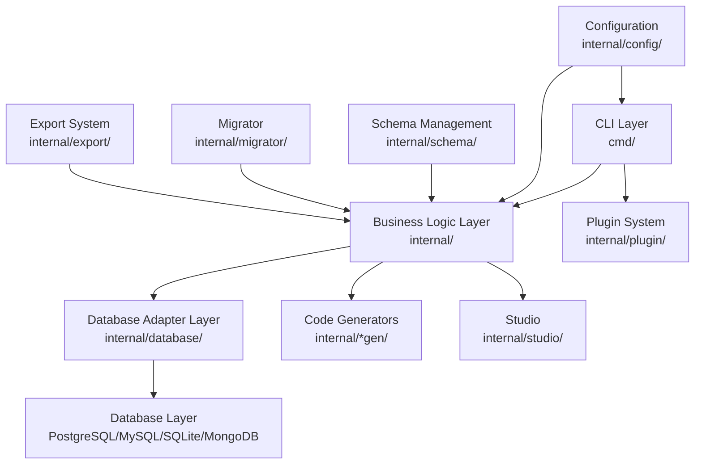

# How Flash ORM Works

This document explains the internal architecture, core components, and workflow of Flash ORM, a powerful database-agnostic ORM built in Go.

## Table of Contents

- [Architecture Overview](#architecture-overview)
- [Core Components](#core-components)
- [Database Adapters](#database-adapters)
- [Migration Workflow](#migration-workflow)
- [Safe Migration System](#safe-migration-system)
- [Schema Management](#schema-management)
- [Parser System](#parser-system)
- [Code Generation System](#code-generation-system)
- [Export System](#export-system)
- [Configuration System](#configuration-system)
- [Plugin System](#plugin-system)
- [Studio Architecture](#studio-architecture)
- [Performance Considerations](#performance-considerations)

## Architecture Overview

Flash ORM follows a layered architecture with clear separation of concerns:



### Key Design Principles

1. **Database Agnostic**: Unified API across PostgreSQL, MySQL, SQLite, MongoDB
2. **Type Safe**: Generated code provides compile-time type checking
3. **Plugin Architecture**: Modular design for different functionality
4. **Safe by Default**: Transaction-based operations with rollback
5. **Performance Focused**: Optimized queries and connection management

## Core Components

### 1. CLI Layer (`cmd/`)

Built using the [Cobra](https://github.com/spf13/cobra) framework, the CLI layer handles:

- **Command Parsing**: Processes user commands and arguments
- **Plugin Management**: Loads and manages plugins dynamically
- **Configuration**: Reads and validates configuration files
- **Error Handling**: Provides user-friendly error messages

### 2. Business Logic Layer

#### Migrator (`internal/migrator/`)
- **Migration Creation**: Generates up/down migration files
- **Migration Execution**: Applies migrations with transaction safety
- **Conflict Detection**: Identifies and resolves schema conflicts
- **Branch Support**: Git-like branching for database schemas

#### Schema Manager (`internal/schema/`)
- **Schema Parsing**: Reads SQL schema files and builds internal representation
- **Schema Comparison**: Compares current vs desired schema state
- **Schema Validation**: Ensures schema integrity and consistency
- **Schema Introspection**: Pulls schema from existing databases

#### Export System (`internal/export/`)
- **Data Extraction**: Exports data in multiple formats (JSON, CSV, SQLite)
- **Format Conversion**: Handles type conversion and relationships
- **Performance Optimization**: Parallel processing for large datasets
- **Compression**: Automatic compression for large exports

### 3. Database Adapter Layer

#### Common Interface
All database adapters implement the `DatabaseAdapter` interface:

```go
type DatabaseAdapter interface {
    Connect(ctx context.Context, url string) error
    Close() error
    Ping(ctx context.Context) error

    // Migration operations
    CreateMigrationsTable(ctx context.Context) error
    GetAppliedMigrations(ctx context.Context) map[string]*time.Time
    ExecuteMigration(ctx context.Context, migrationSQL string) error

    // Schema operations
    GetCurrentSchema(ctx context.Context) ([]types.SchemaTable, error)
    GetTableColumns(ctx context.Context, tableName string) ([]types.SchemaColumn, error)

    // Query execution
    ExecuteQuery(ctx context.Context, query string, args ...interface{}) (*common.QueryResult, error)
}
```

#### Adapter Implementations

- **PostgreSQL Adapter**: Uses `pgx/v5` driver with connection pooling
- **MySQL Adapter**: Uses `go-sql-driver/mysql` with optimized settings
- **SQLite Adapter**: Uses `mattn/go-sqlite3` with WAL mode
- **MongoDB Adapter**: Uses `mongo-driver` with connection pooling

### 4. Code Generation Layer

#### Language Generators

- **Go Generator** (`internal/gogen/`): Generates idiomatic Go code with prepared statements
- **TypeScript Generator** (`internal/jsgen/`): Generates type-safe JavaScript with async/await
- **Python Generator** (`internal/pygen/`): Generates async Python with type hints

#### Query Parser (`internal/parser/`)

Parses SQL queries with special annotations:

```sql
-- name: GetUserByID :one
SELECT id, name, email FROM users WHERE id = $1;

-- name: ListUsers :many
SELECT id, name, email FROM users LIMIT $1 OFFSET $2;
```

## Migration Workflow

### 1. Migration Creation

```bash
flash migrate "add user profiles table"
```

**Process:**
1. Parse current schema files
2. Compare with database state
3. Generate up/down migration SQL
4. Create timestamped migration files

### 2. Migration Execution

```bash
flash apply
```

**Process:**
1. Start database transaction
2. Execute migration SQL
3. Record migration in `_flash_migrations` table
4. Commit transaction or rollback on error

### 3. Safe Migration System

#### Pre-Flight Checks
- **Syntax Validation**: Ensure SQL is syntactically correct
- **Dependency Checking**: Verify required objects exist
- **Conflict Detection**: Check for conflicting schema changes
- **Data Integrity**: Validate potential data loss

#### Transaction Safety
```sql
BEGIN;
-- Migration SQL here
-- If any error occurs, automatic rollback
COMMIT;
```

#### Checksum Verification
Each migration has a checksum to prevent tampering:

```sql
INSERT INTO _flash_migrations (id, name, checksum, applied_at)
VALUES ('001_initial', 'create users table', 'abc123...', NOW());
```

## Schema Management

### Schema Parsing

#### SQL File Parsing
```sql
-- db/schema/users.sql
CREATE TABLE users (
    id SERIAL PRIMARY KEY,
    name VARCHAR(100) NOT NULL,
    email VARCHAR(255) UNIQUE NOT NULL
);
```

**Parsed into:**
```go
SchemaTable{
    Name: "users",
    Columns: []SchemaColumn{
        {Name: "id", Type: "SERIAL", IsPrimary: true, IsAutoIncrement: true},
        {Name: "name", Type: "VARCHAR(100)", Nullable: false},
        {Name: "email", Type: "VARCHAR(255)", Nullable: false, IsUnique: true},
    },
}
```

#### Schema Directory Structure
```
db/schema/
├── users.sql
├── posts.sql
└── comments.sql
```

### Schema Comparison

Compares desired schema (from files) with current database schema:

- **New Tables**: Tables that exist in files but not in database
- **Dropped Tables**: Tables that exist in database but not in files
- **Modified Tables**: Tables with different column definitions
- **New Indexes**: Indexes that need to be created

### Schema Introspection

Pulls schema from existing databases:

```bash
flash pull
```

**Process:**
1. Query system catalogs (`information_schema`, `sqlite_master`, etc.)
2. Extract table definitions, columns, constraints, indexes
3. Generate SQL schema files
4. Create migration for differences

## Code Generation System

### Query Parsing

#### Annotation System
```sql
-- name: GetUserByID :one
SELECT id, name, email FROM users WHERE id = $1;
```

**Parsed as:**
- **Name**: `GetUserByID`
- **Type**: `:one` (returns single row or null)
- **SQL**: `SELECT id, name, email FROM users WHERE id = $1`
- **Parameters**: `$1` (mapped to function parameter)

#### Parameter Mapping
- **PostgreSQL**: `$1, $2, $3...`
- **MySQL**: `?, ?, ?...`
- **SQLite**: `?, ?, ?...`

### Type Mapping

| Database Type | Go Type | TypeScript Type | Python Type |
|---------------|---------|-----------------|-------------|
| `SERIAL` | `int64` | `number` | `int` |
| `VARCHAR(n)` | `string` | `string` | `str` |
| `BOOLEAN` | `bool` | `boolean` | `bool` |
| `TIMESTAMP` | `time.Time` | `Date` | `datetime` |

### Generated Code Structure

#### Go Generation
```go
// flash_gen/db.go - Database interface
type Queries struct {
    db DBTX
}

func (q *Queries) GetUserByID(ctx context.Context, id int64) (User, error) {
    // Generated SQL execution with prepared statements
}
```

#### TypeScript Generation
```typescript
// flash_gen/database.js - Runtime code
export class Queries {
    constructor(db) {
        this.db = db;
    }

    async getUserById(id) {
        const query = `SELECT id, name, email FROM users WHERE id = $1`;
        const result = await this.db.query(query, [id]);
        return result.rows[0] || null;
    }
}
```

## Plugin System

### Plugin Architecture

Flash ORM uses a modular plugin system:

- **Base CLI**: Core functionality (~5-10 MB)
- **Core Plugin**: Full ORM features (~30 MB)
- **Studio Plugin**: Visual interface (~29 MB)
- **All Plugin**: Complete package (~30 MB)

### Plugin Loading

```go
// Plugin registry
type PluginRegistry struct {
    plugins map[string]Plugin
}

// Plugin interface
type Plugin interface {
    Name() string
    Version() string
    Commands() []cobra.Command
    Init() error
}
```

### Plugin Discovery

Plugins are discovered and loaded dynamically:

1. Check for installed plugins in `~/.flash/plugins/`
2. Load plugin binaries
3. Register commands and functionality
4. Provide unified CLI interface

## Studio Architecture

### Web Interface

FlashORM Studio provides a web-based interface:

```
┌─────────────────┐
│   Web Server    │  (Go + Fiber)
│                 │
│   ┌─────────┐   │
│   │  REST   │   │  ← HTTP API
│   │  API    │   │
│   └─────────┘   │
│                 │
│   ┌─────────┐   │
│   │ Web UI  │   │  ← Vue.js SPA
│   │ (Vue.js)│   │
│   └─────────┘   │
└─────────────────┘
```

### Studio Components

- **Database Browser**: View tables, columns, relationships
- **Query Runner**: Execute SQL with syntax highlighting
- **Data Editor**: Inline editing with validation
- **Schema Visualizer**: ER diagrams and schema exploration
- **Migration Manager**: Create and apply migrations visually

## Performance Considerations

### Connection Management

#### Connection Pooling
- **PostgreSQL**: `pgxpool` with configurable min/max connections
- **MySQL**: Built-in connection pooling
- **SQLite**: Single connection with WAL mode

#### Connection Configuration
```go
// Optimized settings
config := pgxpool.Config{
    MaxConns: 10,
    MinConns: 2,
    MaxConnLifetime: 15 * time.Minute,
    MaxConnIdleTime: 3 * time.Minute,
}
```

### Query Optimization

#### Prepared Statements
Generated code uses prepared statements automatically:

```go
// Go: Prepared statement caching
type Queries struct {
    db    DBTX
    stmts map[string]*sql.Stmt  // Statement cache
}
```

#### Batch Operations
```go
// Bulk inserts
func (q *Queries) CreateUsers(ctx context.Context, users []User) error {
    tx, err := q.db.BeginTx(ctx, nil)
    if err != nil {
        return err
    }
    defer tx.Rollback()

    stmt, err := tx.PrepareContext(ctx, "INSERT INTO users (name, email) VALUES ($1, $2)")
    if err != nil {
        return err
    }
    defer stmt.Close()

    for _, user := range users {
        _, err = stmt.ExecContext(ctx, user.Name, user.Email)
        if err != nil {
            return err
        }
    }

    return tx.Commit()
}
```

### Memory Management

#### Streaming for Large Datasets
```go
// Export large tables without loading everything into memory
func (e *Exporter) ExportLargeTable(ctx context.Context, tableName string) error {
    rows, err := e.adapter.ExecuteQuery(ctx, fmt.Sprintf("SELECT * FROM %s", tableName))
    if err != nil {
        return err
    }
    defer rows.Close()

    // Process rows one by one
    for rows.Next() {
        // Stream processing
    }
}
```

### Caching Strategies

#### Query Result Caching
- **Application Level**: Cache frequently accessed data
- **Connection Level**: Reuse prepared statements
- **Schema Caching**: Cache parsed schema information

## Error Handling

### Comprehensive Error Types

```go
// Database-specific errors
type DatabaseError struct {
    Code    string
    Message string
    Query   string
    Args    []interface{}
}

// Migration errors
type MigrationError struct {
    MigrationID string
    Direction   string  // "up" or "down"
    SQL         string
    Underlying  error
}
```

### Error Recovery

#### Automatic Rollback
```go
func (m *Migrator) ApplyMigration(ctx context.Context, migration *Migration) error {
    tx, err := m.adapter.BeginTx(ctx)
    if err != nil {
        return err
    }
    defer tx.Rollback()

    if err := m.executeMigrationSQL(ctx, tx, migration.UpSQL); err != nil {
        return &MigrationError{
            MigrationID: migration.ID,
            Direction:   "up",
            SQL:         migration.UpSQL,
            Underlying:  err,
        }
    }

    if err := m.recordMigration(ctx, tx, migration); err != nil {
        return err
    }

    return tx.Commit()
}
```

### Logging and Monitoring

#### Structured Logging
```go
// Comprehensive logging
logger := logrus.WithFields(logrus.Fields{
    "component": "migrator",
    "migration_id": migration.ID,
    "database": m.config.Database.Provider,
})

logger.Info("Starting migration")
start := time.Now()

// ... migration logic ...

logger.WithFields(logrus.Fields{
    "duration": time.Since(start),
    "status": "success",
}).Info("Migration completed")
```

## Codebase Structure

Flash ORM's codebase is organized into the following packages:

### `cmd/`
CLI commands and entry points:
- `root.go` - Main CLI setup and banner
- `init.go` - Project initialization
- `migrate.go` - Migration creation
- `gen.go` - Code generation
- `apply.go` - Migration application
- `studio.go` - Web studio launcher
- `plugins.go` - Plugin management

### `internal/backup/`
Database backup functionality:
- `backup.go` - Backup creation and restoration

### `internal/branch/`
Schema branching system:
- `manager.go` - Branch operations
- `diff.go` - Schema differences
- `metadata.go` - Branch metadata

### `internal/config/`
Configuration management:
- `config.go` - Configuration loading and validation

### `internal/database/`
Database adapters and factory:
- `adapter.go` - Common database interface
- `factory.go` - Database adapter factory
- `common/` - Shared database utilities
- `mongodb/`, `mysql/`, `postgres/`, `sqlite/` - Database-specific implementations

### `internal/export/`
Data export system:
- `export.go` - Export functionality

### `internal/gogen/`, `internal/jsgen/`, `internal/pygen/`
Code generators:
- `generator.go` - Language-specific code generation

### `internal/migrator/`
Migration system:
- `migrator.go` - Core migration logic
- `operations.go` - Migration operations
- `branch_aware.go` - Branch-aware migrations

### `internal/parser/`
SQL parsing:
- `schema.go` - Schema parsing
- `query.go` - Query parsing
- `types.go` - Type definitions
- `inferrer.go` - Schema inference

### `internal/plugin/`
Plugin system:
- `manager.go` - Plugin loading and execution
- `registry.go` - Plugin registry
- `types.go` - Plugin interfaces

### `internal/pull/`
Schema introspection:
- `pull.go` - Schema pulling from databases
- `generator.go` - Schema generation
- `helpers.go` - Helper functions
- `backup.go` - Backup during pull

### `internal/schema/`
Schema management:
- `schema.go` - Schema operations
- `compare.go` - Schema comparison
- `parser.go` - Schema parsing
- `sqlcompare.go` - SQL-based comparison

### `internal/studio/`
Web studio:
- `studio.go` - Main studio server
- `common/` - Shared studio components
- `mongodb/`, `redis/`, `sql/` - Database-specific studio implementations

### `internal/types/`
Core type definitions:
- `types.go` - Schema and migration types

### `internal/utils/`
Utilities:
- `naming.go` - Naming conventions
- `raw_run.go` - Raw SQL execution
- `sql.go` - SQL utilities
- `utils.go` - General utilities
- `validation.go` - Input validation

### `internal/`
- `main.go` - CLI entry point

### `template/`
Project templates:
- `init.go` - Template generation

### `example/`
Usage examples:
- `go/`, `python/`, `ts/` - Language-specific examples

### `test/`
Testing infrastructure:
- `integration/` - Integration tests

### `npm/`, `python/`
Distribution packages for different platforms.

This architecture ensures Flash ORM is robust, performant, and maintainable while providing a consistent experience across different databases and programming languages.
