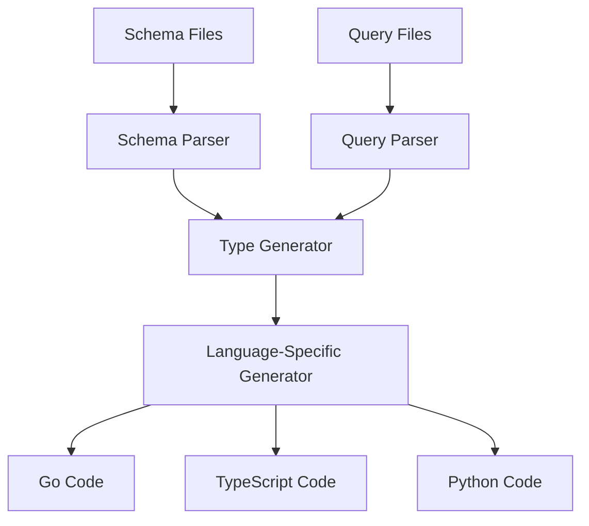

# Code Generation

Flash ORM automatically generates type-safe code for Go, TypeScript/JavaScript, and Python from your SQL queries and schema definitions.

## Table of Contents

- [How It Works](#how-it-works)
- [Generated Code Structure](#generated-code-structure)
- [Go Code Generation](#go-code-generation)
- [TypeScript Code Generation](#typescript-code-generation)
- [Python Code Generation](#python-code-generation)
- [Query Parsing](#query-parsing)
- [Type Mapping](#type-mapping)
- [Customization](#customization)
- [Best Practices](#best-practices)

## How It Works

### Code Generation Pipeline



### Input Sources

1. **Schema Files** (`db/schema/*.sql`): Define database structure
2. **Query Files** (`db/queries/*.sql`): Define SQL queries with special comments

### Generation Process

```bash
flash gen
```

This command:
1. Parses all schema files to understand table structures
2. Parses all query files to understand operations
3. Generates type-safe interfaces for each language
4. Creates prepared statements and connection handling

## Generated Code Structure

### Common Structure

```
flash_gen/
├── database.{ext}     # Database connection interface
├── models.{ext}       # Data models/types (Go only)
├── {table1}.{ext}     # Table-specific queries
├── {table2}.{ext}     # Table-specific queries
└── ...
```

### Generated Files by Language

| Language | Files Generated | Purpose |
|----------|----------------|---------|
| Go | `db.go`, `models.go`, `users.go`, `posts.go` | Database interface, types, and queries |
| TypeScript | `index.js`, `index.d.ts`, `database.js`, `users.js` | Runtime code and type definitions |
| Python | `__init__.py`, `database.py`, `users.py`, `posts.py` | Async database interface and queries |

## Go Code Generation

### Generated Files

```go
// flash_gen/db.go - Database interface
package flash_gen

import (
    "context"
    "database/sql"
)

type DBTX interface {
    ExecContext(ctx context.Context, query string, args ...interface{}) (sql.Result, error)
    PrepareContext(ctx context.Context, query string) (*sql.Stmt, error)
    QueryContext(ctx context.Context, query string, args ...interface{}) (*sql.Rows, error)
    QueryRowContext(ctx context.Context, query string, args ...interface{}) *sql.Row
}

type Queries struct {
    db DBTX
}

func New(db DBTX) *Queries {
    return &Queries{db: db}
}
```

```go
// flash_gen/models.go - Generated types
package flash_gen

import (
    "time"
)

type User struct {
    ID        int64     `json:"id"`
    Name      string    `json:"name"`
    Email     string    `json:"email"`
    IsActive  bool      `json:"is_active"`
    CreatedAt time.Time `json:"created_at"`
    UpdatedAt time.Time `json:"updated_at"`
}

type CreateUserParams struct {
    Name  string `json:"name"`
    Email string `json:"email"`
}

type UpdateUserParams struct {
    Name     *string `json:"name,omitempty"`
    Email    *string `json:"email,omitempty"`
    IsActive *bool   `json:"is_active,omitempty"`
}
```

```go
// flash_gen/users.go - Query implementations
package flash_gen

import (
    "context"
)

func (q *Queries) GetUserByID(ctx context.Context, id int64) (User, error) {
    // Generated SQL query execution
}

func (q *Queries) CreateUser(ctx context.Context, arg CreateUserParams) (int64, error) {
    // Generated INSERT query
}

func (q *Queries) UpdateUser(ctx context.Context, id int64, arg UpdateUserParams) error {
    // Generated UPDATE query
}
```

### Usage Example

```go
package main

import (
    "context"
    "database/sql"
    "yourproject/flash_gen"

    _ "github.com/lib/pq"
)

func main() {
    db, _ := sql.Open("postgres", "postgres://...")
    queries := flash_gen.New(db)

    // Type-safe operations
    userID, err := queries.CreateUser(context.Background(), flash_gen.CreateUserParams{
        Name:  "John Doe",
        Email: "john@example.com",
    })

    user, err := queries.GetUserByID(context.Background(), userID)
    // user is fully typed: flash_gen.User
}
```

## TypeScript Code Generation

### Generated Files

```typescript
// flash_gen/index.d.ts - Type definitions
export interface User {
  id: number;
  name: string;
  email: string;
  is_active: boolean;
  created_at: Date;
  updated_at: Date;
}

export interface CreateUserParams {
  name: string;
  email: string;
}

export interface UpdateUserParams {
  name?: string;
  email?: string;
  is_active?: boolean;
}

export declare class Queries {
  createUser(params: CreateUserParams): Promise<number>;
  getUserById(id: number): Promise<User>;
  updateUser(id: number, params: UpdateUserParams): Promise<void>;
  // ... more methods
}
```

```javascript
// flash_gen/database.js - Runtime implementation
const { Pool } = require('pg');

class Queries {
  constructor(db) {
    this.db = db;
  }

  async createUser(params) {
    const query = `INSERT INTO users (name, email) VALUES ($1, $2) RETURNING id`;
    const result = await this.db.query(query, [params.name, params.email]);
    return result.rows[0].id;
  }

  async getUserById(id) {
    const query = `SELECT id, name, email, is_active, created_at, updated_at FROM users WHERE id = $1`;
    const result = await this.db.query(query, [id]);
    return result.rows[0] || null;
  }
}

function New(db) {
  return new Queries(db);
}

module.exports = { New };
```

### Usage Example

```typescript
import { Pool } from 'pg';
import { New } from './flash_gen/database';

const pool = new Pool({
  connectionString: process.env.DATABASE_URL,
});

const db = New(pool);

// Type-safe operations with full IDE support
const userId = await db.createUser({
  name: 'John Doe',
  email: 'john@example.com',
});

const user = await db.getUserById(userId);
// user: User (fully typed)
```

## Python Code Generation

### Generated Files

```python
# flash_gen/__init__.py
from .database import new

__all__ = ["new"]
```

```python
# flash_gen/database.py
from typing import Optional, List, Protocol
import asyncpg

class DatabaseConnection(Protocol):
    async def execute(self, query: str, *args) -> None: ...
    async def fetchrow(self, query: str, *args) -> Optional[dict]: ...
    async def fetch(self, query: str, *args) -> List[dict]: ...

class Queries:
    def __init__(self, db: DatabaseConnection):
        self.db = db

    async def create_user(self, name: str, email: str) -> int:
        query = "INSERT INTO users (name, email) VALUES ($1, $2) RETURNING id"
        result = await self.db.fetchrow(query, name, email)
        return result['id']

    async def get_user_by_id(self, user_id: int) -> Optional[dict]:
        query = """
        SELECT id, name, email, is_active, created_at, updated_at
        FROM users WHERE id = $1
        """
        return await self.db.fetchrow(query, user_id)

def new(db: DatabaseConnection) -> Queries:
    return Queries(db)
```

### Usage Example

```python
import asyncio
import asyncpg
from flash_gen import new

async def main():
    pool = await asyncpg.create_pool('postgresql://...')
    db = new(pool)

    # Type-safe operations
    user_id = await db.create_user('John Doe', 'john@example.com')
    user = await db.get_user_by_id(user_id)
    # user has full type hints

if __name__ == '__main__':
    asyncio.run(main())
```

## Query Parsing

### Query File Format

```sql
-- db/queries/users.sql

-- name: GetUserByID :one
SELECT id, name, email, is_active, created_at, updated_at
FROM users WHERE id = $1;

-- name: GetUserByEmail :one
SELECT id, name, email, is_active, created_at, updated_at
FROM users WHERE email = $1;

-- name: CreateUser :one
INSERT INTO users (name, email) VALUES ($1, $2) RETURNING id;

-- name: UpdateUser :exec
UPDATE users SET name = $2, email = $3, updated_at = NOW()
WHERE id = $1;

-- name: DeleteUser :exec
DELETE FROM users WHERE id = $1;

-- name: ListUsers :many
SELECT id, name, email, is_active, created_at, updated_at
FROM users ORDER BY created_at DESC LIMIT $1 OFFSET $2;
```

### Query Annotations

| Annotation | Description | Return Type |
|------------|-------------|-------------|
| `:one` | Returns single row | Single object or null |
| `:many` | Returns multiple rows | Array of objects |
| `:exec` | Execute without return | void/number of affected rows |
| `:execrows` | Execute and return affected rows | Number |

### Parameter Binding

```sql
-- Positional parameters ($1, $2, etc.)
-- name: CreatePost :one
INSERT INTO posts (user_id, title, content)
VALUES ($1, $2, $3) RETURNING id;

-- Named parameters (experimental)
-- name: UpdateUser :exec
UPDATE users SET
    name = COALESCE($name, name),
    email = COALESCE($email, email)
WHERE id = $user_id;
```

## Type Mapping

### Database to Language Types

| Database Type | Go Type | TypeScript Type | Python Type |
|---------------|---------|-----------------|-------------|
| `SERIAL` | `int64` | `number` | `int` |
| `INTEGER` | `int32` | `number` | `int` |
| `BIGINT` | `int64` | `number` | `int` |
| `VARCHAR(n)` | `string` | `string` | `str` |
| `TEXT` | `string` | `string` | `str` |
| `BOOLEAN` | `bool` | `boolean` | `bool` |
| `TIMESTAMP` | `time.Time` | `Date` | `datetime` |
| `JSONB` | `[]byte` | `any` | `dict` |
| `UUID` | `string` | `string` | `str` |
| `BYTEA` | `[]byte` | `Buffer` | `bytes` |

### Nullable Types

```go
// Go: Pointers for nullable fields
type User struct {
    ID       int64      `json:"id"`
    Name     string     `json:"name"`
    Email    *string    `json:"email"`    // Nullable
    Bio      *string    `json:"bio"`      // Nullable
    AvatarURL *string   `json:"avatar_url"` // Nullable
}
```

```typescript
// TypeScript: Union types
interface User {
  id: number;
  name: string;
  email: string | null;
  bio: string | null;
  avatar_url: string | null;
}
```

```python
# Python: Optional types
from typing import Optional

class User:
    id: int
    name: str
    email: Optional[str]
    bio: Optional[str]
    avatar_url: Optional[str]
```

## Customization

### Custom Query Logic

```sql
-- name: GetUserWithPosts :one
SELECT
    u.id, u.name, u.email, u.is_active, u.created_at, u.updated_at,
    COALESCE(json_agg(
        json_build_object(
            'id', p.id,
            'title', p.title,
            'content', p.content,
            'published', p.published,
            'created_at', p.created_at
        )
    ) FILTER (WHERE p.id IS NOT NULL), '[]') as posts
FROM users u
LEFT JOIN posts p ON u.id = p.user_id
WHERE u.id = $1
GROUP BY u.id;
```

### Complex Joins

```sql
-- name: GetPostDetails :one
SELECT
    p.id, p.title, p.content, p.published, p.created_at,
    u.id as author_id, u.name as author_name, u.email as author_email,
    COALESCE(json_agg(
        json_build_object(
            'id', c.id,
            'content', c.content,
            'author_name', cu.name,
            'created_at', c.created_at
        )
    ) FILTER (WHERE c.id IS NOT NULL), '[]') as comments
FROM posts p
JOIN users u ON p.user_id = u.id
LEFT JOIN comments c ON p.id = c.post_id
LEFT JOIN users cu ON c.user_id = cu.id
WHERE p.id = $1
GROUP BY p.id, u.id;
```

### Conditional Queries

```sql
-- name: SearchUsers :many
SELECT id, name, email, is_active, created_at, updated_at
FROM users
WHERE
    ($1::text IS NULL OR name ILIKE '%' || $1 || '%') AND
    ($2::boolean IS NULL OR is_active = $2) AND
    ($3::timestamp IS NULL OR created_at >= $3)
ORDER BY created_at DESC
LIMIT $4 OFFSET $5;
```

## Best Practices

### Query Organization

```
db/queries/
├── users/
│   ├── auth.sql       # Authentication queries
│   ├── profile.sql    # Profile management
│   └── search.sql     # Search functionality
├── posts/
│   ├── crud.sql       # Basic CRUD
│   ├── feed.sql       # Feed algorithms
│   └── analytics.sql  # Analytics queries
└── shared/
    └── common.sql     # Shared queries
```

### Naming Conventions

```sql
-- Use consistent naming
-- name: GetUserByID :one     ✅
-- name: get_user_by_id :one  ❌ (snake_case)
-- name: userById :one        ❌ (camelCase)

-- Use descriptive names
-- name: GetUser :one         ✅
-- name: GetU :one            ❌ (too short)
-- name: GetUserData :one     ✅

-- Use consistent return types
-- name: ListUsers :many      ✅
-- name: GetUsers :many       ✅
-- name: FindUsers :many      ✅
```

### Performance Considerations

```sql
-- Use appropriate indexes (defined in schema)
-- Keep queries focused and simple
-- Avoid N+1 query problems with joins

-- Good: Single query with join
-- name: GetPostsWithAuthors :many
SELECT p.*, u.name as author_name, u.email as author_email
FROM posts p
JOIN users u ON p.user_id = u.id;

-- Bad: Multiple queries in loop
-- (Avoid this pattern in generated code)
```

### Error Handling

```go
// Go: Handle specific errors
user, err := queries.GetUserByID(ctx, userID)
if err != nil {
    if errors.Is(err, sql.ErrNoRows) {
        return nil, fmt.Errorf("user not found")
    }
    return nil, fmt.Errorf("failed to get user: %w", err)
}
```

```typescript
// TypeScript: Handle async errors
try {
    const user = await db.getUserById(userId);
    if (!user) {
        throw new Error('User not found');
    }
    return user;
} catch (error) {
    console.error('Database error:', error);
    throw error;
}
```

```python
# Python: Handle async errors
try:
    user = await db.get_user_by_id(user_id)
    if not user:
        raise ValueError("User not found")
    return user
except Exception as e:
    logger.error(f"Database error: {e}")
    raise
```

### Testing Generated Code

```typescript
// TypeScript tests
describe('User Queries', () => {
  it('should create and retrieve user', async () => {
    const userId = await db.createUser({
      name: 'Test User',
      email: 'test@example.com',
    });

    const user = await db.getUserById(userId);
    expect(user).toMatchObject({
      id: userId,
      name: 'Test User',
      email: 'test@example.com',
    });
  });
});
```

### Version Control

```bash
# Generated code should be committed
git add flash_gen/
git commit -m "feat: update generated code"

# Regenerate after schema/query changes
flash gen
git add flash_gen/
git commit -m "feat: regenerate code after schema changes"
```

Remember: Generated code is your application's interface to the database. Keep your schema and queries well-organized, test thoroughly, and regenerate code whenever you make database changes.
